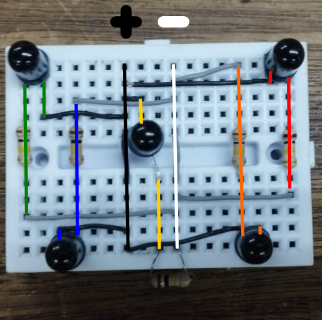

# 🔬 SensorArray for Laser Lissajous Curves

Un proyecto de investigación universitaria que implementa un sistema de detección y análisis de curvas de Lissajous usando un arreglo de sensores. El sistema utiliza MicroPython en ESP32 y 5 fototransistores para capturar y analizar patrones de movimiento de láser.
**IMPORTANTE:** Aun no se realiza el analisis en las curvas de lisajous, por ahora la informacion medida son de una luz roja movida a mano.


## Características

- **Arreglo de 5 fototransistores** OP598 NPNs dispuestos estratégicamente
- **Microcontrolador ESP32** con MicroPython para control y adquisición de datos
- **Análisis en tiempo real** de patrones de movimiento láser
- **Detección de curvas de Lissajous** y patrones geométricos
- **Visualización interactiva** de datos y análisis estadístico

## Configuración del Hardware

### Componentes
- 1x ESP32 (MicroPython v1.22.2)
- 5x Fototransistores OP598 NPN
- 5x Resistencias de 100kΩ
- 1x LED de 635nm
- Protoboard y cables de conexión

### Disposición Espacial de Sensores



### Conexiones Eléctricas
- **Alimentación**: 3.3V compartido (ESP32)
- **Tierra**: Común con ESP32
- **Señales analógicas**: Pines ADC del ESP32
  - Azul: Pin 39
  - Verde: Pin 36  
  - Amarillo: Pin 34
  - Naranja: Pin 35
  - Rojo: Pin 4

## 🚀 Inicio Rápido

### Requisitos del Sistema
```bash
# Dependencias de Python
numpy>=1.21.0
pandas>=1.3.0
matplotlib>=3.4.0
scipy>=1.7.0
jupyter>=1.0.0
```

### Instalación
1. **Clonar el repositorio**
   ```bash
   git clone https://github.com/JuanJ27/SensorArray-for-laser-Lissajous-curves.git
   cd SensorArray-for-laser-Lissajous-curves
   ```

2. **Configurar el entorno Python**
   ```bash
   pip install -r requirements.txt
   ```

3. **Flashear MicroPython en ESP32**
   ```bash
   # Usar el firmware incluido en hardware/firmware/
   esptool.py --chip esp32 --port /dev/ttyUSB0 write_flash -z 0x1000 hardware/firmware/ESP32_GENERIC-20240222-v1.22.2.bin
   ```

4. **Cargar código del sensor**
   ```bash
   # Copiar sensor_array.py al ESP32
   ampy --port /dev/ttyUSB0 put hardware/sensor_array.py main.py
   ```

### Uso Básico
1. **Ejecutar captura de datos**
   - El ESP32 iniciará automáticamente la captura
   - Los datos se guardan en formato CSV

2. **Análisis de datos**
   ```bash
   jupyter notebook notebooks/analisis_fototransistores.ipynb
   ```

## Estructura del Proyecto

```
📁 SensorArray-for-laser-Lissajous-curves/
├── 📄 README.md              # Este archivo
├── 📄 LICENSE                # Licencia del proyecto
├── 📄 requirements.txt       # Dependencias Python
├── 📁 hardware/              # Código y firmware del hardware
│   ├── 📄 sensor_array.py    # Código principal MicroPython
│   └── 📁 firmware/          # Firmware ESP32
├── 📁 notebooks/             # Análisis y visualizaciones
│   └── 📄 analisis_fototransistores.ipynb
├── 📁 data/                  # Datasets experimentales
│   ├── 📄 horizontal_sweep.csv
│   ├── 📄 vertical_sweep.csv
│   ├── 📄 diagonal_pattern.csv
│   └── 📄 random_motion.csv
├── 📁 docs/                  # Documentación técnica
│   ├── 📄 hardware_setup.md
│   ├── 📄 data_format.md
│   └── 📄 analysis_guide.md
├── 📁 assets/                # Imágenes y recursos
│   ├── 📄 circuit_diagram.png
│   ├── 📄 sensor_layout.png
│   └── 📄 sample_plots.png
└── 📁 results/               # Resultados y presentaciones
    └── 📄 Analisis_Fototransistores.pptx
```

## 🔬 Metodología

### Tipos de Patrones Detectados
1. **Movimiento Horizontal** - Barrido lineal en eje X
2. **Movimiento Vertical** - Barrido lineal en eje Y  
3. **Patrones Diagonales** - Movimientos en 45°
4. **Movimiento Aleatorio** - Para calibración y pruebas

### Formato de Datos
Los datos se capturan en formato CSV con la siguiente estructura:
```csv
tiempo,azul,verde,amarillo,naranja,rojo
0,1024,2048,3072,1536,2560
```
- **Tiempo**: Timestamp en milisegundos
- **Sensores**: Valores ADC (0-4095, resolución 12-bit)

## Resultados

El sistema es capaz de:
-  Generar visualizaciones temporales
-  Exportar datos para análisis posterior

## Contribuciones

Las contribuciones son bienvenidas.

## Licencia

Este proyecto está licenciado bajo la Licencia MIT - ver el archivo [LICENSE](LICENSE) para detalles.

## Autor

**Juan J** - [JuanJ27](https://github.com/JuanJ27)
